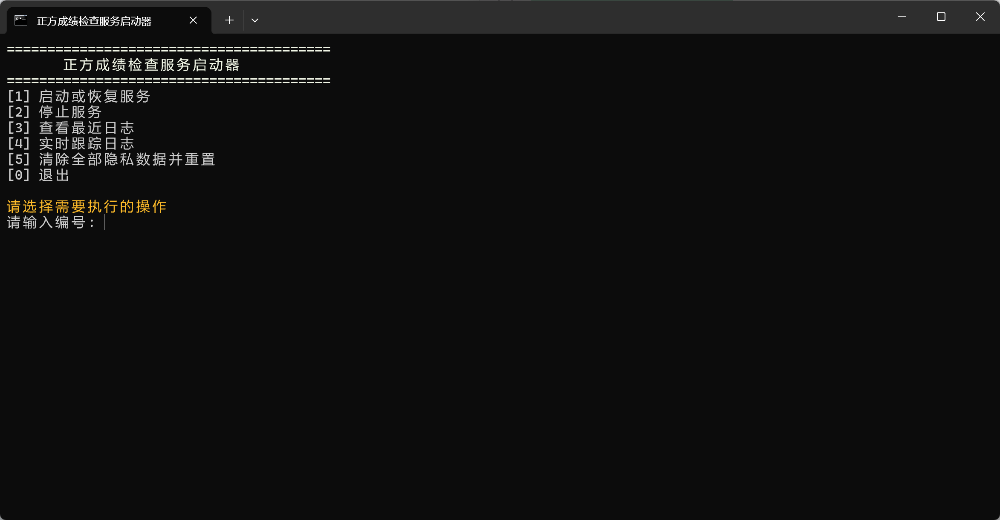
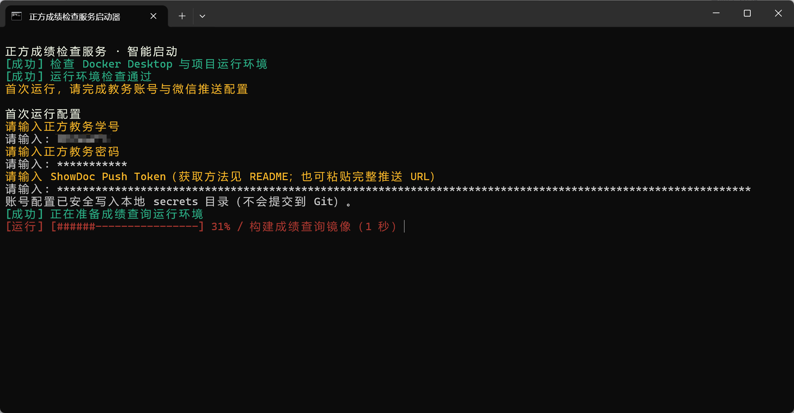
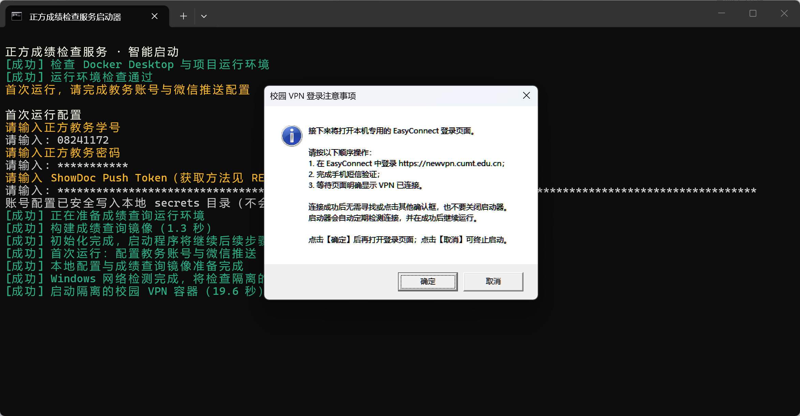
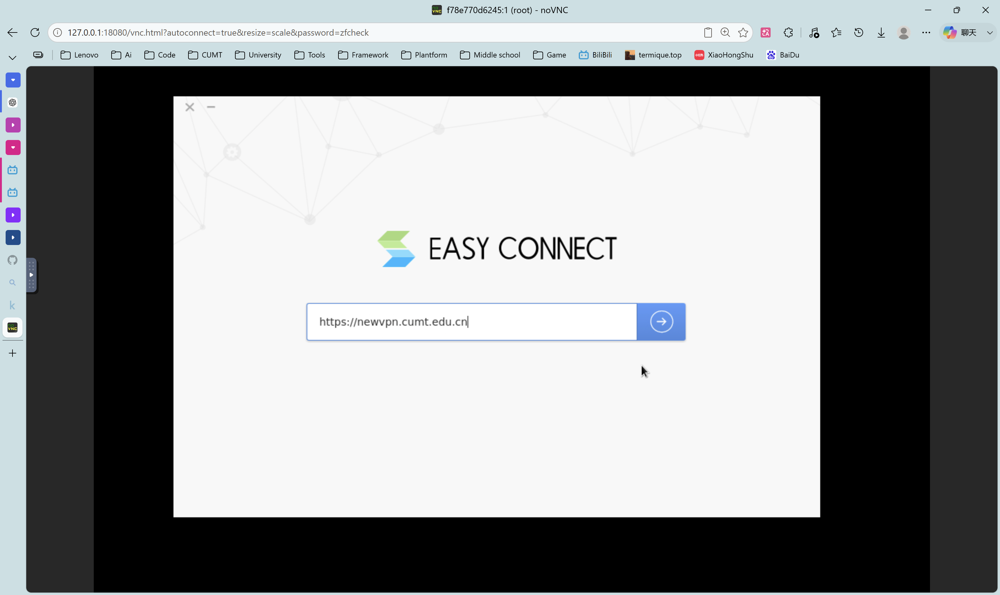
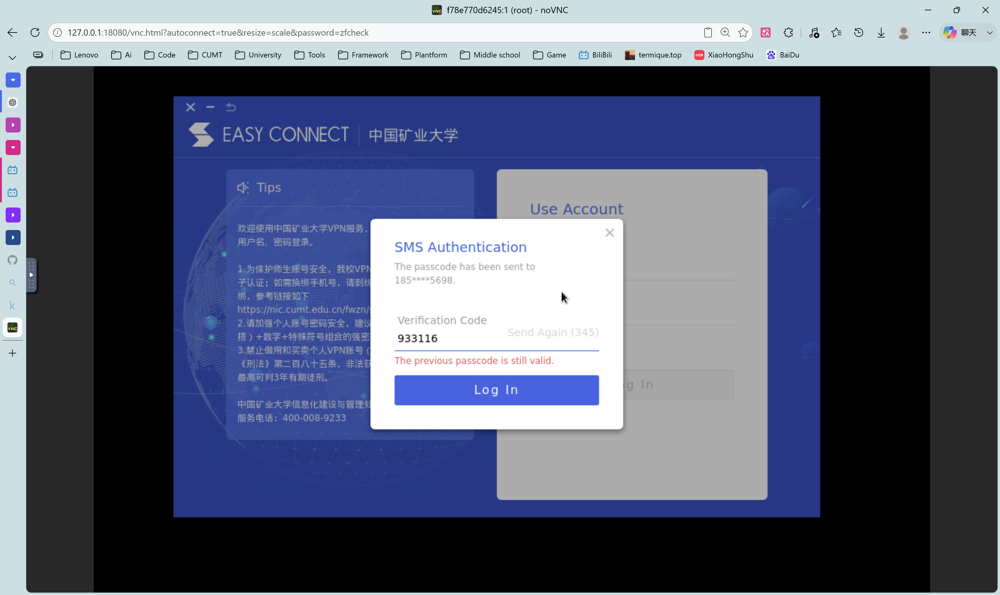
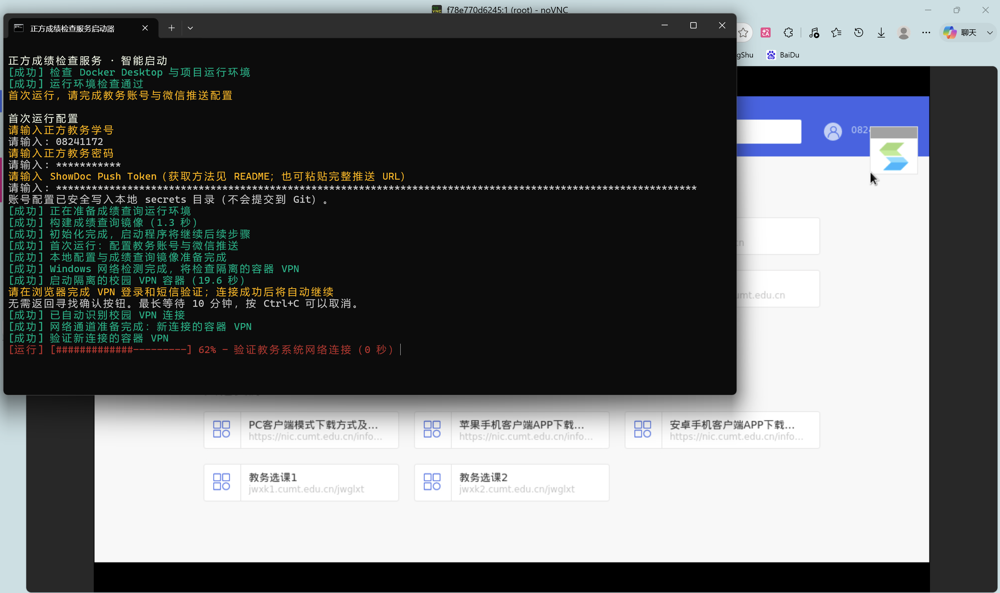
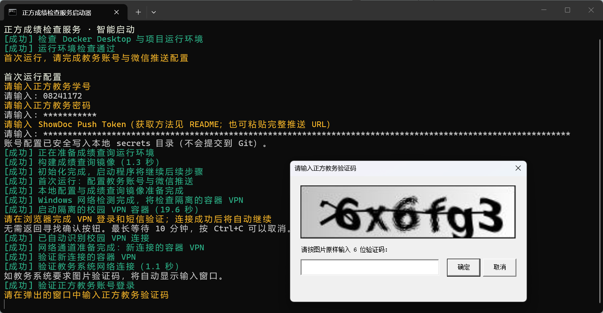
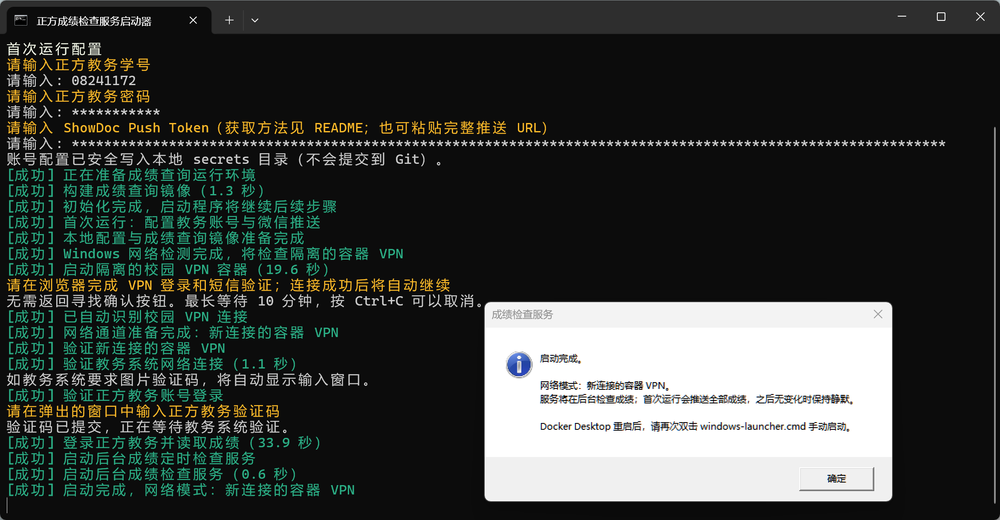

# 正方教务成绩检查与微信推送

在 Windows 11 上通过 Docker 定时检查正方教务成绩；校外访问时使用隔离的 EasyConnect 容器连接校园 VPN，并通过 ShowDoc Push 将结果发送到微信。

## 项目背景

[NianBroken/ZFCheckScores](https://github.com/NianBroken/ZFCheckScores) 提供了基于 GitHub Actions 的正方教务成绩查询托管方案，但中国矿业大学教务系统需要校园内网，校外访问还需要 EasyConnect 和手机短信验证，无法直接放在 GitHub Actions 中长期运行。

本项目将成绩检查器和 EasyConnect 分别放入 Docker 容器，并提供一个面向 Windows 11 的中文启动器。启动器会先实际检测 Windows 和 Docker 是否已经能够访问教务系统：可以直连时不启动 VPN；只有无法直连且现有容器 VPN 不可用时，才引导用户完成 EasyConnect 登录。这样既不需要额外虚拟机，也不会修改 Windows 路由或干扰 Clash 等宿主机网络工具。

## 功能

- **智能选择网络**：自动选择 Docker Bridge、Docker Desktop Host 网络或隔离的容器 VPN。
- **复用登录状态**：保存正方 Cookie，并定期保持教务会话和 VPN 活跃，日常检查不需要反复输入验证码。
- **微信成绩推送**：第一次成功查询推送全部成绩；以后无变化时静默，有变化时推送按时间从新到旧排列的完整成绩单。
- **标记成绩变化**：新增课程标记“新增”，已有课程成绩或字段变化标记“更新”。
- **断联告警**：区分 VPN、正方系统和登录会话故障，通知中显示累计监测时长和恢复方法。
- **统一 Windows 启动器**：一个菜单完成启动、停止、日志查询和隐私数据清除。
- **轻量交互**：VPN 登录前先显示操作说明，连接成功后自动继续；正方验证码直接通过置顶小窗口输入。
- **隐私隔离**：账号、Token、Cookie、成绩基线和 VPN 会话均保存在被 Git 忽略的本地目录中。

## 快速开始

### 1. 准备运行环境

需要准备：

- Windows 11；
- 中国矿业大学 VPN 账号、正方教务账号和密码；
- 可接收通知的微信；
- Docker Desktop（Linux Containers）。

本项目不会自动安装 Docker。请从 [Docker Desktop 官方下载页](https://www.docker.com/products/docker-desktop/) 自行下载安装，并按照 [Windows 官方安装文档](https://docs.docker.com/desktop/setup/install/windows-install/) 启用 WSL 2 后端。启动 Docker Desktop 后，在 PowerShell 中运行：

```powershell
docker info --format '{{.OSType}}'
```

输出应为 `linux`。若为 `windows`，请在 Docker Desktop 菜单中切换到 Linux Containers。

### 2. 获取 ShowDoc Push 地址

1. 打开 [ShowDoc 推送服务](https://push.showdoc.com.cn/)；
2. 使用微信扫码登录并关注对应公众号；
3. 进入右上角“推送”页面；
4. 复制专属推送地址，格式如下：

```text
https://push.showdoc.com.cn/server/api/push/你的token
```

首次配置时既可以粘贴完整地址，也可以只粘贴最后的 Token。该地址属于私密凭证，请勿截图公开或提交到 Git。

### 3. 下载项目

使用 Git：

```powershell
git clone https://github.com/TermiQue/check-scores-for-zf.git
cd check-scores-for-zf
```

也可以在 GitHub 页面点击 **Code → Download ZIP**，解压后进入项目目录。

### 4. 打开统一启动器

双击项目根目录中的 `windows-launcher.cmd`，或在 PowerShell 中运行：

```powershell
.\windows-launcher.cmd
```

选择“启动或恢复服务”。首次运行时依次输入：

1. 正方教务学号；
2. 正方教务密码；
3. ShowDoc Push 完整地址或 Token。

启动器会自动构建镜像并检测网络。任务执行时显示红色旋转状态或动态进度条，完成后原地切换成绿色“成功”。

<p align="center">
  
</p>

> 操作：输入 `1` 并按回车。首次运行会进入账号配置；以后再次启动时会复用本地配置。

<p align="center">
  
</p>

> 操作：按提示依次输入学号、密码和 ShowDoc Push 地址或 Token。密码及 Token 输入时不会显示明文。

### 5. 按提示完成验证

- 如果当前网络可以访问教务系统，启动器会直接继续，不打开 EasyConnect。
- 如果需要容器 VPN，先阅读弹出的注意事项，确认后在浏览器完成 EasyConnect 登录和短信验证；页面显示连接成功后无需寻找确认按钮，启动器会自动检测并继续。
- 如果正方要求图片验证码，直接在置顶窗口中输入并确认。
- 出现“启动完成”弹窗后可以关闭启动器窗口，成绩检查服务会在 Docker 后台运行。

#### 5.1 登录校园 VPN（仅校外网络需要）

<p align="center">
  
</p>

> 操作：先读完注意事项，再点击“确定”。浏览器随后会打开本机 EasyConnect 页面。

<table>
  <tr>
    <td width="50%"></td>
    <td width="50%"></td>
  </tr>
  <tr>
    <td>① 地址保持为 <code>https://newvpn.cumt.edu.cn</code>，登录学校 VPN 账号。</td>
    <td>② 获取并输入手机短信验证码，等待页面显示 VPN 已连接。</td>
  </tr>
</table>

<p align="center">
  
</p>

> 完成后：无需关闭网页，也无需返回终端按键。保持 VPN 页面连接，启动器检测成功后会自动继续。

#### 5.2 输入正方图片验证码（按需出现）

<p align="center">
  
</p>

> 操作：按图片原样输入 6 位验证码并点击“确定”。同一次登录只会弹出一个有效输入窗口。

#### 5.3 确认启动完成

<p align="center">
  
</p>

> 完成后：关闭启动器窗口即可，成绩检查器会继续在 Docker 后台运行。需要查看状态时重新打开启动器并选择日志功能。

默认每 30 分钟检查一次成绩，每 5 分钟保持一次教务会话心跳。第一次成功查询会立即向微信推送当前全部成绩。

## 进一步阅读

| 文档 | 内容 |
| --- | --- |
| [文档中心](docs/README.md) | 全部文档的分类入口 |
| [Windows 部署与使用手册](WINDOWS-CONTAINER-VPN.md) | 完整安装、VPN 登录、验证码、故障恢复和常见问题 |
| [配置参考](docs/CONFIGURATION.md) | `.env` 参数、启动器参数和诊断选项 |
| [日常运维与隐私](docs/OPERATIONS.md) | 启停、日志、推送测试、数据目录和隐私清理 |
| [技术架构](docs/ARCHITECTURE.md) | 容器、网络模式、数据模型、状态机和安全边界 |
| [开发与测试](docs/DEVELOPMENT.md) | 项目结构、测试方式、致谢与许可证 |
